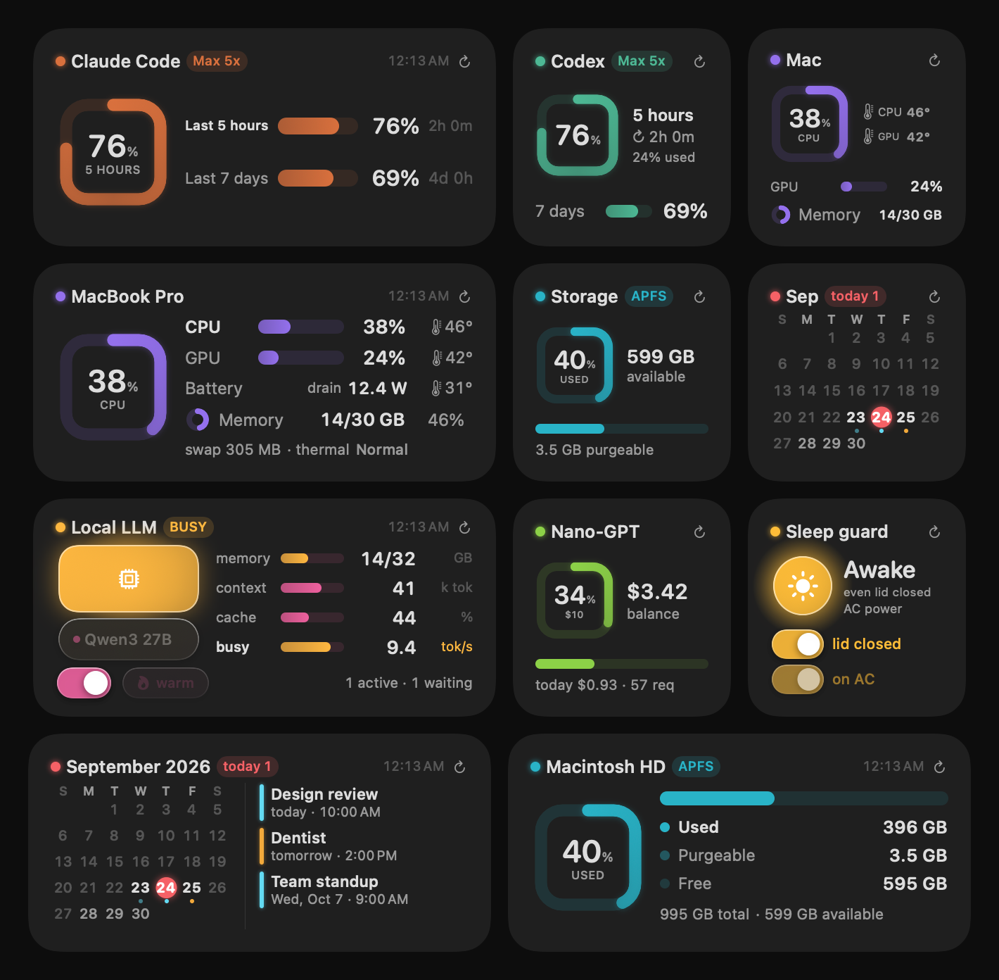

# Pano

**Desktop widgets for macOS that show what your Mac and your AI tools are doing — at a glance.**

Pano is a small menu-bar app plus a WidgetKit extension for macOS 14+ (designed for macOS 26 Tahoe). It shows your Claude Code and Codex usage limits, live system load and temperatures, disk space, your calendar, a local LLM server and a prepaid API balance. It can also keep the Mac awake. All of it uses one visual language: dials, bars and small glass switches.



> *Pano* is Turkish for "board" or "dashboard". The interface is in English and Turkish and follows your system language.

## Widgets

| Widget | Sizes | What it shows |
|---|---|---|
| **Claude Code** / **Codex** | S · M | Remaining quota for the 5-hour and weekly windows, reset countdowns, plan badge. Turns orange above 75 % used and red above 90 %. |
| **Mac system** | S · M | CPU and GPU load, memory and swap, CPU/GPU temperature, thermal state. The medium size adds battery temperature and live power draw in watts (battery or adapter). |
| **Storage** | S · M | Used, purgeable and free space on the boot volume, matching Finder's numbers. |
| **Calendar** | S · M | Month grid with a dot under each day that has events (in the calendar's colour); the medium size adds upcoming events. Click a day or an event to open it in Calendar. |
| **Local LLM** ([oMLX](https://github.com/jundot/omlx)) | S · M | Server state (off / idle / loading / ready / generating), model memory, context size, cache hit rate, tokens per second. Start/stop and warm up from the widget, and pick the model. |
| **Nano-GPT balance** | S · M | Prepaid balance on a fixed full-scale bar, today's and 30-day spend, most-used model. |
| **Sleep guard** | S · M | Two switches: *lid closed* (`pmset disablesleep`) and *on power* (no idle sleep on AC). |

Each card has a refresh button that reloads every widget at once. Buttons and switches on the cards are interactive (App Intents).

## How it works

```
┌────────────── Pano.app (menu bar, not sandboxed) ─────────────┐
│ collectors: quota APIs · host_statistics · IOKit/SMC · ioreg  │
│             EventKit · oMLX HTTP · Nano-GPT HTTP · pmset       │
│      │ writes JSON snapshots                                   │
│      ▼                                                         │
│ ~/Library/Application Support/Pano/*.json                     │
│      └── mirrored into the widget's sandbox container ──┐     │
└──────────────────────────────────────────────────────────┼────┘
                                                           ▼
┌───────── PanoWidgets.appex (WidgetKit, sandboxed) ───────────┐
│ reads the snapshot → draws the card                           │
│ button tap → AppIntent → Darwin notification ──► back to app  │
│ calendar click → pano://calendar?day=… ──────► back to app    │
└───────────────────────────────────────────────────────────────┘
```

- **The app does the work; the widget only draws.** A widget extension has to be sandboxed (without the sandbox entitlement it never registers with `pluginkit`). A sandboxed extension can't read the Keychain, run `pmset` or ask for Calendar access. So the menu-bar app collects everything and writes small JSON snapshots.
- **No App Group.** App Groups need a provisioning profile, and Pano builds with an ad-hoc signature (no Apple Developer account needed). Instead, the app also writes each snapshot into the extension's container at `~/Library/Containers/dev.pano.app.widgets/…`. Inside the sandbox `~` already points there, so both sides use the same path code.
- **Interactive widgets.** A tap runs an `AppIntent` in the extension. The intent writes an optimistic "changing…" state so the card reacts at once, then posts a Darwin notification. The app does the privileged work and reloads the timeline. If the app isn't running, the pending state times out after 20 s and the card goes back to the real state.
- **Calendar clicks** go through a custom URL scheme to the app. `ical://ekevent/<id>` selects the event but doesn't bring the window forward or change the day (measured), so the app follows up with AppleScript `view calendar at <date>`.

### How the Claude Code and Codex quotas are read

Pano uses the credentials the official CLIs already store on your Mac. It never asks for a password, and nothing leaves your machine except the same requests the CLIs make themselves.

- **Claude Code** keeps its OAuth credentials in the macOS Keychain (item `Claude Code-credentials`), not in a file. Pano reads the item with `/usr/bin/security`. Calling `SecItem*` from Pano's own binary would re-trigger a Keychain access prompt after every rebuild. `~/.claude/.credentials.json` is used as a fallback. Usage comes from the same endpoint the CLI's `/usage` command uses.
- **Codex** reads `~/.codex/auth.json` and asks the ChatGPT usage endpoint, which reports the 5-hour and weekly windows.
- **Token refresh:** when an access token has expired, Pano refreshes it and **writes it back to where it came from**. The refresh token rotates, so a refresh that wasn't saved back would sign the CLI out.
- The usage endpoints are rate-limited, so quotas are polled every 5 minutes.
- If a CLI isn't set up, its card says *"Not signed in — run `claude` once"* instead of showing an error.

These are internal endpoints of the official tools, not public APIs, so they can change without notice. Pano is not affiliated with Anthropic or OpenAI.

## Requirements

- A Mac with Apple Silicon (M1–M5). Everything except the temperature sensors also works on Intel; on Intel the temperatures show "—".
- macOS 14 or later; the design targets macOS 26.
- Xcode 26 or later, and [XcodeGen](https://github.com/yonaskolb/XcodeGen) (`brew install xcodegen`).

## Build and install

```bash
git clone https://github.com/afsozer/Pano.git && cd Pano
Tools/install.sh
```

The script generates the Xcode project, builds a Release app with an ad-hoc signature, installs it to `~/Applications/Pano.app` and launches it. It also checks that the widget extension is really running the new binary; see [Troubleshooting](#troubleshooting) for why that check exists.

Then right-click the desktop → **Edit Widgets…** → **Pano**.

On first launch macOS asks for **Calendar** access; it's needed only for the calendar widget. The first calendar click asks for permission to control **Calendar** (Automation). The app lives in the menu bar and not in the Dock. The menu has a "launch at login" switch.

## Configuration (optional)

Everything works without a config file. Create `~/.config/pano/config.json` only to change the defaults:

```json
{
  "nanogptApiKey": "YOUR_NANOGPT_API_KEY",
  "nanogptFullScaleUsd": 10,
  "omlx": {
    "baseURL": "http://127.0.0.1:8000",
    "home": "~/.omlx",
    "brewService": "omlx",
    "brewFormula": "jundot/omlx/omlx",
    "models": ["my-model-a", "my-model-b"],
    "displayNames": { "my-model-a": "Model A 27B" }
  },
  "sleepGuard": {
    "acSleepRestoreMinutes": 1
  }
}
```

- **Nano-GPT key:** looked up in the `NANOGPT_API_KEY` environment variable, then `nanogptApiKey`, then OpenCode's `auth.json`. Without a key the card shows how to add one.
- **`nanogptFullScaleUsd`:** the balance that fills the bar. Below 25 % of it the bar turns orange, below 10 % red. Above it, the bar turns sky-blue and gets a "$10+" badge, so a $40 and a $10 account don't look the same.
- **oMLX:** the address defaults to oMLX's own `settings.json`. If `models` is empty, the picker offers every model the server lists.

The file is read again whenever it changes; no restart is needed.

## Sleep guard and root

`pmset` needs root. The first time you flip a sleep-guard switch, Pano shows the standard administrator password dialog **once**. In that single root session it applies the setting and installs `/etc/sudoers.d/pano`. That rule allows **exactly** these commands and nothing else:

```
<you> ALL=(root) NOPASSWD: /usr/bin/pmset -a disablesleep 0, /usr/bin/pmset -a disablesleep 1, /usr/bin/pmset -c sleep 0, /usr/bin/pmset -c sleep 1
```

After that, the app uses `sudo -n` silently. How the rule is installed:

- The root program is passed inline to `osascript … with administrator privileges`, so there is no script file on disk that another process could replace between writing and running it.
- The rule is written by root into a root-owned temp file, checked with `visudo -cf`, then moved into place.
- Reading the current state never needs root: `pmset -g` and `pmset -g custom`.

To install the rule by hand instead:

```bash
t=$(mktemp) && printf '%s\n' "$(whoami) ALL=(root) NOPASSWD: /usr/bin/pmset -a disablesleep 0, /usr/bin/pmset -a disablesleep 1, /usr/bin/pmset -c sleep 0, /usr/bin/pmset -c sleep 1" > "$t" \
  && sudo visudo -cf "$t" && sudo install -m 0440 -o root -g wheel "$t" /etc/sudoers.d/pano; rm -f "$t"
```

*Lid closed* keeps the Mac awake in every power profile, on battery and with the lid shut. The card warns in orange when it's on while running on battery. *On power* only disables idle system sleep on the AC profile; the display still sleeps.

## Engineering notes

Things that were measured while building this, not assumed:

- **CPU/GPU temperature on any Apple Silicon Mac.** SMC key names differ between chip generations: M1/M2 use `Tp*`/`Tg*`, M3 uses `Te*` plus shared `Tf*`, M4/M5 use `Te*`/`Tp*` and `Tg*`. Pano doesn't hard-code a list per model. It walks the SMC key table once (about 2,800 keys, ~0.5 s, then cached), keeps float sensors in a plausible 10–120 °C range, and averages them. On an M5 this matches the per-model list within 0.3 °C. It also showed that 7 of the hand-written keys don't exist on that machine.
- **GPU load** comes from `IOAccelerator` → `PerformanceStatistics` → "Device Utilization %"; no root needed.
- **Disk space via `URLResourceValues`, not `df`.** The system volume is separate, so `df /` reports ~12 GB used while the APFS container really holds ~400 GB. "Available" uses `volumeAvailableCapacityForImportantUsage`, which is Finder's number and includes purgeable space.
- **Battery from one `ioreg` call.** `system_profiler` takes seconds. `ioreg` output nests dictionaries with *different* separators (`"Key" = 1` at the top level, `"Key"=1` inside), which is how same-named inner fields are told apart. "On adapter" ≠ "charging": optimized charging holds the battery at 80–85 % with `IsCharging = No`.
- **Liquid Glass isn't used inside widgets.** `glassEffect` swallows the whole button in `ImageRenderer`. The glass look is drawn by hand with material, a gradient rim and a shadow, so it renders the same everywhere.
- **Signing and permissions.** An ad-hoc signature's designated requirement is its cdhash, which changes on every build, so the Calendar permission was asked again after each reinstall. Pano pins the requirement to the bundle identifier.
- **Widget updates after reinstall.** When the app quits, `chronod` immediately relaunches the extension from the old file. That process keeps running the deleted binary (different inode), so the new layout never appears. `Tools/install.sh` kills the extension after copying and checks the inode.

## Development

```bash
Tools/render-preview.sh                           # render every card to PNG (build/preview)
PANO_PREVIEW_SAMPLE=1 Tools/render-preview.sh     # sample data only, no personal data (used for docs/gallery.png)
```

Desktop widgets are usually hidden behind windows, so layouts are checked by rendering the SwiftUI views to PNG with `ImageRenderer`. That's how clipped or wrapping text gets caught.

**Localization:** English is the source language. Turkish lives in `Sources/Shared/Resources/tr.lproj/Localizable.strings`, which ships in both the app and the widget bundle. Numbers, percentages ("34%" / "%34"), dates, the first weekday and weekday letters follow the user's locale.

```
Sources/App/      menu-bar app: collectors, providers, sudoers helper, SMC bridge (C)
Sources/Shared/   snapshot models + stores, App Intents, paths, localization
Sources/Widget/   WidgetKit views, one file per widget + shared components
Tools/            install script, PNG preview renderer
project.yml       XcodeGen spec (the .xcodeproj is generated, not committed)
```

## Troubleshooting

- **A new widget doesn't appear in the gallery:** `chronod` caches widget definitions per extension version. Bump `CURRENT_PROJECT_VERSION` in `project.yml` and reinstall. `pluginkit -m -v -A -D | grep dev.pano` should print exactly one line.
- **Code changed but the widget looks the same:** run `pkill -f PanoWidgets.appex; killall chronod`, or just use `Tools/install.sh`.
- **A card says "stale":** the app isn't running, or its data source stopped answering. Snapshots older than their threshold are flagged instead of shown as current.

## Türkçe özet

Pano, macOS masaüstü için widget seti ve menü çubuğu uygulamasıdır. Claude Code ve Codex kota pencerelerini, CPU/GPU yükünü ve sıcaklığını, belleği, diski, pil gücünü, Apple Takvim'i, yerel LLM sunucusunu (oMLX) ve Nano-GPT bakiyesini gösterir. İki anahtarlı bir uyku bekçisi de içerir. Arayüz sistem diline göre Türkçe ya da İngilizce açılır.

- **Kurulum:** `brew install xcodegen`, sonra `Tools/install.sh`. Masaüstüne sağ tıkla → *Widget'ları Düzenle* → **Pano**. Apple Developer üyeliği gerekmez; ad-hoc imza yeterli.
- **Veri:** Menü çubuğu uygulaması veriyi toplar, sandbox'lı widget yalnız çizer. Claude Code kimliği Keychain'den, Codex kimliği `~/.codex/auth.json`'dan okunur. Süresi dolan jetonlar yenilenip kaynağına geri yazılır. Hiçbir veri makineden bu CLI'lerin kendi isteklerinin ötesine çıkmaz.
- **Ayarlar:** İsteğe bağlı `~/.config/pano/config.json` dosyasıyla yapılır; şeması yukarıda.
- **Uyku bekçisi:** Yalnız dört `pmset` komutuna izin veren bir sudoers kuralını bir kez yönetici parolasıyla kurar.

## License

© 2026 Alpaslan Fatih Sözer. All rights reserved. The source code is published for review only; it may not be used, copied, modified or distributed without written permission.

Tüm hakları saklıdır. Kaynak kod yalnızca inceleme amacıyla yayımlanmıştır; yazılı izin olmadan kullanılamaz, kopyalanamaz, değiştirilemez veya dağıtılamaz.
